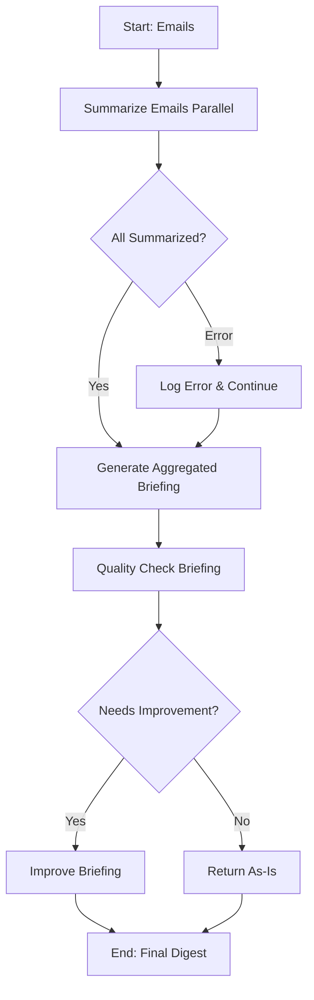

# LangGraph Refactoring - What Changed

## Overview

Refactored the email digest agent to use **LangGraph** with parallel processing, quality checking, and LangSmith tracing.

## Key Changes

### 1. Parallel Email Processing ✅

**Before**: Sequential loop through emails (slow)
```python
for email in emails:
    summary = summarize_email(email)  # One at a time
```

**After**: LangGraph parallel processing
```python
# LangGraph processes all emails concurrently
workflow.add_node("summarize_emails", self._summarize_emails_parallel)
```

**Benefit**: 5-6 emails processed simultaneously instead of sequentially. Faster execution!

---

### 2. Quality Checker Node ✅

**New Node**: `quality_check_briefing`

Reviews the aggregated briefing for:
- ✅ **Clarity**: High school level language
- ✅ **Actionability**: Practical takeaways
- ✅ **Structure**: Three sections well-organized
- ✅ **Tone**: Casual and conversational

The quality checker **improves** the briefing if needed, or returns it as-is if already excellent.

**Workflow**:
```
Summarize Emails → Generate Briefing → Quality Check → Final Output
```

---

### 3. LangSmith Tracing ✅

**Added Package**: `langsmith`

**Configuration** in `config/settings.py`:
```python
LANGSMITH_API_KEY = os.getenv("LANGSMITH_API_KEY")
LANGSMITH_TRACING = True
LANGSMITH_ENDPOINT = "https://api.smith.langchain.com"
LANGSMITH_PROJECT = "AI Newsletter Digest"
```

**Benefits**:
- 📊 Trace every LLM call
- 🔍 Debug workflows visually
- ⏱️ Monitor performance
- 💰 Track token usage

---

## LangGraph Workflow



---

## Setup LangSmith

### 1. Get API Key

1. Go to [LangSmith](https://smith.langchain.com/)
2. Sign up / Log in
3. Go to Settings → API Keys
4. Create new API key

### 2. Add to Environment

Edit `.env`:
```bash
LANGSMITH_API_KEY=lsv2_pt_your_api_key_here
```

### 3. Verify Tracing

Run the agent and check LangSmith dashboard:
```bash
uv run main.py --dry-run
```

Visit: https://smith.langchain.com/

You'll see:
- All LLM calls traced
- Each node in the workflow
- Input/output for every step
- Token usage and costs

---

## State Management

**ProcessorState** (TypedDict):
```python
{
    "emails": List[Email],                    # Input emails
    "digests": List[EmailDigest],            # Parallel results (combined)
    "aggregated_briefing": str,              # Initial briefing
    "reviewed_briefing": str,                # Quality-checked briefing
    "errors": List[str]                      # Errors (combined)
}
```

**Annotated with `add`**: Parallel results automatically merge into lists.

---

## Testing

### Test Locally
```bash
# Dry run to see LangSmith traces
uv run main.py --dry-run
```

### Check LangSmith Dashboard
- Project: "AI Newsletter Digest"
- See all traces for debugging
- Monitor token usage

### Production Run
```bash
# Full run (sends email)
uv run main.py
```

---

## What You Get Now

1. **Faster**: Parallel email processing
2. **Better Quality**: AI reviews and improves briefing
3. **Observable**: Full tracing in LangSmith
4. **Maintainable**: Clear LangGraph workflow structure

---

## Docker Note

Since we have hot-reloading enabled, just restart the container:
```bash
docker-compose restart
```

No rebuild needed! 🚀
